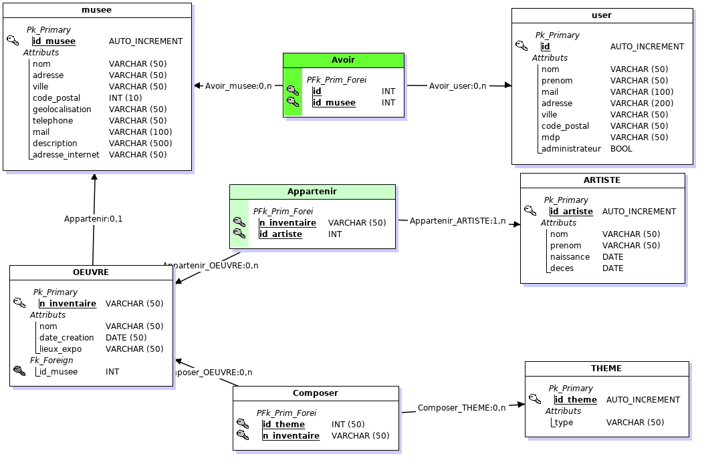

# museum
Description:

Application de recherche d'expo et de musée.

Elle permet a un utilisateur de se connecter et de rechercher 
-  un musée
-  une oeuvre
-  un theme
-  un artiste
- ou par sa geolocalisation.
  
On enregistre sa recherche afin qu'il puisse la revoir ultérieurement et le renvoie sur le site d'achat.

***

## __Fonctionnement__:

### useCase

### MCD

### MLD

***

## __End-points__:

- http://localhost:8080/Mexpo

> Page d'acceil du site
        
        

## __Exemple de requetes__: 
